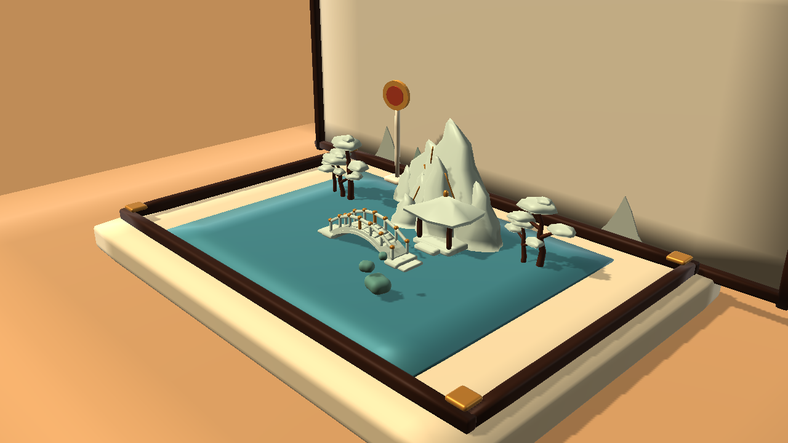

# Perspective Painting / 视角成画

一款正在开发的 3D 透视构图解谜游戏。玩家在微缩展台上移动、调整前后层并旋转山石、树木、桥和凉亭，让它们从指定视角重构成目标山水画。



## 当前版本

当前仓库包含一个 Windows 垂直切片和四个可玩关卡：

- Mist Valley：桥与凉亭的入门构图；
- Moon Garden：远山、中山、桥与凉亭的前后层关系；
- Red Cliffs：八件景物的完整构图；
- Twin Seal：主画面与侧面印章轮廓的双视角实验。

游戏按最终视觉结果判定，不要求玩家复刻作者隐藏的三维坐标。不同的三维排列只要形成等价画面，也可以通关。

## 操作

- 鼠标左键拖动：选择并移动景物；
- 鼠标滚轮：调整景物所在的前后层；
- `Q` / `E`：向左 / 向右旋转选中景物；
- `Space`：第一关俯看棋盘；
- `Tab`：放大比较目标画面与当前画面；
- `H`：选中当前提示的景物并显示目标区域；
- `G`：可选的一件景物辅助摆放；
- `Ctrl + Z`：撤销；
- `R`：重置当前关卡；
- `Esc`：暂停与帮助。

侧栏会显示目标画、实时构图、目标区域、移动方向和明确的旋转按键次数。

## 试玩 Windows 版本

正式发布后，请从仓库的 **Releases** 页面下载完整 ZIP。不要只下载 `.exe`：Unity 的数据目录和运行库必须与程序放在一起。

当前本机构建入口：

```text
Builds/WindowsPainting/PerspectivePainting.exe
```

`Builds/` 不进入 Git 仓库，公开试玩包会作为 GitHub Release 附件发布。

## 从源码打开

要求：

- Unity `6000.3.18f1`；
- Universal Render Pipeline；
- Windows 10/11（当前主要验证平台）。

步骤：

1. 克隆仓库；
2. 在 Unity Hub 中选择“从磁盘添加项目”；
3. 打开仓库根目录；
4. 等待 Unity 恢复包和导入资源；
5. 打开 `Assets/Scenes/PaintingPrototype.unity` 开始第一关。

Windows 构建菜单：

```text
Tools / PerspectivePuzzle / Build Painting Windows Development
```

## 技术结构

- `Assets/Scripts/Domain`：与 Unity 场景解耦的投影、评分和诊断逻辑；
- `Assets/Scripts/Presentation`：输入、实时构图、提示、UI 与通关揭晓；
- `Assets/Scripts/Editor`：四关场景生成、目标捕获、视觉回归和 Windows 构建；
- `Assets/Tests`：EditMode 与 PlayMode 自动化测试；
- `Assets/Content/PaintingPrototype/References`：目标美术图、轮廓和 Object-ID 真值；
- `docs/`：产品、架构、美术方向和制作决策。

目标画面由项目自己的隐藏解答场景生成。运行时使用低分辨率 Object-ID 缓冲区比较轮廓、可见面积和遮挡关系，不做通用照片识别，也不要求 RGB 像素完全一致。

## 当前状态与限制

这是验证玩法和产品方向的开发版本，不是正式商业发行版。目前：

- 仅提供键鼠和 Windows 构建；
- 没有存档、设置菜单、账号或联网功能；
- 模型是程序化制作的风格化原型，未来仍需正式 DCC 美术资产；
- 第四关的双视角规则仍属于实验机制；
- 自动化测试不能代替玩家对难度、可读性和美术质感的评价。

## 隐私

游戏不联网、不创建账号。试玩指标仅保存在玩家本机，用于记录匿名的完成时间和操作摩擦，不包含身份信息。

## 第三方内容

当前没有导入第三方源码或第三方美术资产。详见 [THIRD_PARTY_NOTICES.md](THIRD_PARTY_NOTICES.md)。

## 许可证

本项目采用“保留全部权利”的专有许可，仅开放查看和试玩，不授权复制、修改、再发布、制作衍生作品或用于商业项目。详见 [LICENSE](LICENSE)。
